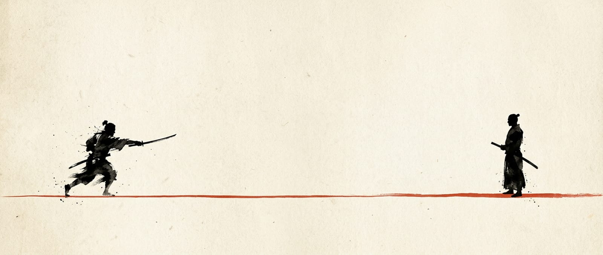
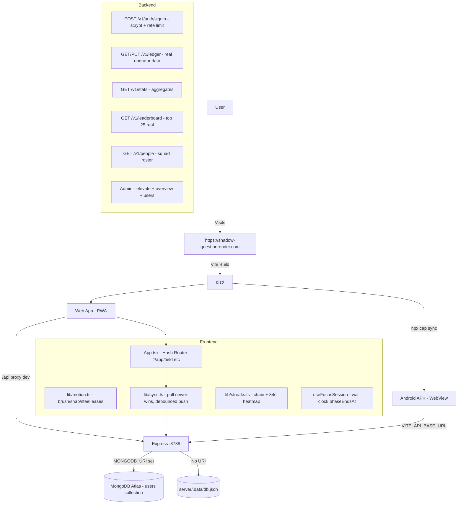

<div align="center">


# Shadow Quest — 影の道
### *The Path of Shadows — A Deep Work Samurai Productivity OS*

**Ink, Paper & Steel. Not another purple-gradient SaaS. A real product for real focus.**

<br/>

[](https://shadow-quest.onrender.com)
[](./package.json)
[](#copyright--license)
[](#pwa--android-apk)

<br/>

[](https://react.dev/)
[](https://vitejs.dev/)
[](https://www.typescriptlang.org/)
[](https://gsap.com/)
[](https://nodejs.org/)
[](https://expressjs.com/)
[](https://www.mongodb.com/)
[](https://capacitorjs.com/)
[](#pwa--android-apk)

**[Live Website](https://shadow-quest.onrender.com) • [Backend Docs](./docs/BACKEND.md) • [APK Guide](./docs/APK.md) • [Security](./docs/SECURITY.md)**

</div>

---

## Preview — Ink & Paper Aesthetic

<div align="center">

| Hero — Sumi Ink Ground | Deep Work — Ensō Clock | Mobile — App Face |
|:---:|:---:|:---:|
|  |  |  |
| Warm black `#0c0b0a` · Bone paper `#f4efe6` | One circle fills, one drains | Thumb-ready · 44px targets · PWA |

*Every artwork is paper mounted on ink — the inversion is the whole art direction.*

</div>

---

## Table of Contents

- [What is Shadow Quest?](#what-is-shadow-quest)
- [Features](#features)
- [Approach in Simple Words](#approach-in-simple-words)
- [Tech Stack — Real Links & Logos](#tech-stack--real-links--logos)
- [Architecture](#architecture)
- [Project Structure](#project-structure)
- [Quick Start](#quick-start)
- [Environment Variables](#environment-variables)
- [API Reference](#api-reference)
- [PWA & Android APK](#pwa--android-apk)
- [Security & Password Gate](#security--password-gate)
- [Motion System](#motion-system)
- [Testing & Audits](#testing--audits)
- [Roadmap](#roadmap)
- [Contributing](#contributing)
- [Copyright & License](#copyright--license)

---

## What is Shadow Quest?

**Shadow Quest is not a to-do app. It's a Samurai Operating System for Deep Work.**

Most productivity apps look like dashboards. Shadow Quest feels like a dojo.

- You pick a **Focus Technique** — Pomodoro 間, Ultradian 波, 52/17 律, Flowmodoro 流, Zazen 座, Kaizen 改 — each with a kanji seal.
- You enter the **Field** (`#/app/field`) — an ensō ring that fills while you focus and drains while you rest. Wall-clock accurate, survives tab close, refresh, lid close.
- You seal goals, build **streaks** (7/30/60/100/180/365), track **life-factors** on a radar, see **84-day heatmap**, **weekly momentum**, and **marks**.
- Everything syncs to a real backend (MongoDB) or falls back to device ledger — no fake data, ever.

> **Live Now:** https://shadow-quest.onrender.com — Try the Deep Work room, create a ledger, install as PWA.

---

## Features

### Core Productivity
- **Real Task Ledger** — Add, link, seal, reopen goals. No seeds. Empty on first login.
- **Ensō Clock** — One brushed circle = your focus. Fills & drains with `phaseEndsAt` wall-clock logic.
- **6 Techniques** — Pomodoro, Ultradian, 52/17, Flowmodoro (count-up), Zazen (stillness), Kaizen (sprints).
- **Streak Engine** — `src/lib/streaks.ts` computes live chain from sealed tasks + habit marks + last active.
- **Your Signal Dashboard** — Level ring, rolling counters, radar (7 life-factors), 84-day heatmap, momentum bars, reward donut.

### Rituals & Growth
- **Habits Panel** — Daily ritual with kanji seal per date, time-of-day reminders, 7-day dot row.
- **Milestones / Ladder** — Real leaderboard `GET /v1/leaderboard` — top 25 by progress, with `you` marker. Offline = honest device copy.
- **Squad Roster** — `GET /v1/people` — live registered operators, not mocked.
- **Bilingual Focus Areas** — English + Japanese + romaji furigana (`nameJa / readingJa / schoolJa`).

### Experience
- **True Phone Face** — Below `860px` it becomes an app: bottom tab bar, safe-area insets, 44px targets, no grain/vignette compositor cost. `src/styles/mobile.css` is breakpoint-scoped.
- **Ink / Paper Theme** — Toggle in nav: dark sumi ground vs inverted paper ledger. Persists per browser.
- **Offline First** — `src/lib/sync.ts` — pull on load (server wins if newer), debounced push, flush on `pagehide`.
- **Notifications** — One per phase change, one per habit due — permission-gated, tab-coalesced.

### Owner Control
- **Admin Panel** `#/app/admin` — Owner only (`ADMIN_EMAILS` + `ADMIN_PIN`), re-verified by backend every call. Overview, user directory (only place with emails), revoke all sessions.

---

## Approach in Simple Words

We asked: **What if a productivity app felt like ink, not plastic?**

1. **The World is Ink** — Ground is warm sumi black `#0c0b0a`, never pure `#000`. Light is bone paper `#f4efe6`. Vermilion `#c1362b` is used for exactly 3 things: blade line, active state, one dot per screen. Brass `#a98a55` only for ki/guard readouts.

2. **Paper Plates, Not Cards** — Artwork is shown on the paper it was painted on. Roster cards are paper too. The site is ink, artwork is paper — that inversion is the art direction.

3. **Brush Motion, Not Bounce** — Site moves like a loaded brush. 3 eases only: `brush`, `snap`, `steel` + `breath`. 5 reveal verbs (`rise / wipe / draw / brush / bleed`) via `data-rv`. SVG is genuinely inked with `feTurbulence` + `feDisplacementMap`.

4. **One Number Drives One Thing** — Growth loop ring = one full circle, marker at `p = i/N`, active = `floor(p*N)`. Ensō arc = CSS transition exactly `TICK_MS` long. No two numbers fight.

5. **Real Data or No Data** — Fresh ledger is empty. Leaderboard is real operators or honest fallback. Squad is real registrations. No fake rows to look busy.

6. **Phone is an App, Not Squeezed Site** — Below 860px: docked bottom nav, thumb reach, safe insets, no hover-only motion, no blend-mode overlays. Above: laptop keeps HUD exactly as authored.

**In short:** Ink ground, paper art, brush motion, real data, wall-clock truth, phone as app.

---

## Tech Stack — Real Links & Logos

<div align="center">

[](https://skillicons.dev)

</div>

### Frontend — The Dojo UI

| Tech | Version | Purpose | Link |
|------|---------|---------|------|
|  **React** | `19.1.0` | UI, Hash routing, Error boundary | [react.dev](https://react.dev/) |
|  **Vite** | `7.0.0` | Build, Dev server, Proxy | [vitejs.dev](https://vitejs.dev/) |
|  **TypeScript** | `5.8.3` Strict | Type safety | [typescriptlang.org](https://www.typescriptlang.org/) |
|  **Vanilla CSS** | Tokens + Layers | No UI kit, no framework | [tokens.css](./src/styles/tokens.css) |
| **GSAP** | `3.13.0` + Free Plugins | Motion: `SplitText`, `DrawSVG`, `ScrambleText`, `CustomEase` | [gsap.com](https://gsap.com/) |
| **PWA** | `manifest.webmanifest` | Installable, standalone | [web.dev/pwa](https://web.dev/progressive-web-apps/) |

**Fonts:** Cinzel (display, epic serif) · Manrope (body) · Oswald (labels) · Shippori Mincho (Japanese accents) via Google Fonts.

### Backend — The Ledger Keeper

| Tech | Version | Purpose | Link |
|------|---------|---------|------|
|  **Node.js** | `>=18` | Runtime | [nodejs.org](https://nodejs.org/) |
|  **Express** | `4.21.2` | API server `:8788` | [expressjs.com](https://expressjs.com/) |
|  **MongoDB** | `6.9.0` driver | Production store (Atlas) | [mongodb.com](https://www.mongodb.com/) |
| **File Store** | JSON fallback | Dev fallback `server/.data/db.json` | [docs/BACKEND.md](./docs/BACKEND.md) |
| **CORS + Security** | Custom | Rate limits, scrypt, bearer tokens | [docs/SECURITY.md](./docs/SECURITY.md) |

### Mobile — Same Bundle, Native Shell

| Tech | Version | Purpose | Link |
|------|---------|---------|------|
|  **Capacitor** | `8.5.2` | WebView shell → APK | [capacitorjs.com](https://capacitorjs.com/) |
|  **Android** | AGP 8.13 / SDK 36 | APK build, edge-to-edge | [developer.android.com](https://developer.android.com/) |
| **Sharp** | `0.35.4` | Asset gen: JPEG + alpha masks | [sharp.pixelplumbing.com](https://sharp.pixelplumbing.com/) |

### Tools & Infra

- **Happy DOM** `20.14.5` — Smoke tests without browser
- **Render** — Live hosting https://shadow-quest.onrender.com
- **GitHub Actions** — `.github/workflows/android.yml` builds & releases APK
- **CSP Meta** — Injected at build, works inside APK WebView (no headers there)

---

## Architecture



**Key Design Decisions:**

- **Hash Routing** `#/` — One document, GSAP timelines survive navigation, ink wipe bridges swaps.
- **Same Bundle Everywhere** — `dist` is what web ships and what APK bundles. No second codebase.
- **Real Data Only** — No seeds. Empty ledger on first login. Leaderboard = real operators or honest fallback badge.
- **Wall-Clock Session** — `phaseEndsAt` + persisted record = survives background tab, closed lid, refresh. Settle banks only elapsed minutes.

---

## Project Structure

```
shadow-quest/
├── src/
│   ├── api/              # transport, mappers, mock duel engine, contract notes
│   │   ├── client.ts     # API client with bearer token
│   │   ├── mock.ts       # Deep Work duel engine (self-contained game)
│   │   └── contract.md   # Assumed contract for duel
│   ├── components/
│   │   ├── Boot.tsx      # Ink aurora boot curtain (CSS loops, dies with curtain)
│   │   ├── Nav.tsx       # Top nav with theme toggle
│   │   ├── FaultLine.tsx # Error boundary - sealed recovery screen
│   │   ├── session/      # Ensō ring - brushed, turbulence-displaced
│   │   ├── habits/       # Daily ritual panel - kanji seals
│   │   └── hud/          # HUD elements
│   ├── hooks/
│   │   ├── useFocusSession.ts  # Wall-clock session engine
│   │   └── useApi.ts     # API hooks with fallback
│   ├── lib/
│   │   ├── motion.ts     # Eases (brush/snap/steel/breath) + reveals + cursor
│   │   ├── reveal.ts     # data-rv wiring (rise/wipe/draw/brush/bleed)
│   │   ├── sync.ts       # Bridge: pull newer wins, debounced push, flush on close
│   │   ├── streaks.ts    # Chain + 84d grid + milestones (7/30/60/100/180/365)
│   │   ├── statsCalc.ts  # Client-side stats aggregation (fallback)
│   │   ├── auth.ts       # Scoped auth + PBKDF2 offline gate
│   │   ├── password.ts   # 12+ chars, upper+lower+digit+symbol policy
│   │   └── techniques.ts # 6 focus shapes with kanji seals
│   ├── mobile/           # Phone face - separate shell, own chrome
│   │   ├── MobileApp.tsx # Bottom nav + tab routing
│   │   └── screens/      # Home, Tasks, Progress, Rewards, Squad, Profile, Stats
│   ├── pages/
│   │   ├── Home.tsx      # Landing - Hero, Ticker, Way, Roster, Ladder, Outro
│   │   ├── Field.tsx     # Deep Work room - ensō + technique picker
│   │   ├── Login.tsx     # Gate with strength meter
│   │   └── Admin.tsx     # Owner console
│   ├── sections/         # Desktop sections
│   │   ├── Dashboard.tsx # Today's ledger
│   │   ├── StatsBoard.tsx# Animated stats dashboard
│   │   └── Ladder.tsx    # Milestones with live/device badge
│   └── styles/
│       ├── tokens.css    # Sumi black, bone paper, vermilion, brass
│       ├── home.css      # Landing
│       ├── app.css       # App shell
│       ├── mobile.css    # Breakpoint-scoped, loaded last
│       └── theme-light.css # Paper theme - token swap
├── server/
│   └── src/
│       ├── index.mjs     # Express API :8788
│       ├── store.mjs     # MongoDB ↔ file store abstraction
│       ├── security.mjs  # scrypt, rate limits, caps, sanitizers
│       ├── engine.mjs    # Stats aggregation
│       └── admin.mjs     # Admin vault + overview
├── android/              # Capacitor native shell (gitignored public is built)
├── public/
│   ├── img-src/          # Painted masters
│   ├── img/              # Derived JPEG + alpha masks
│   ├── icons/            # PWA icons from icon.svg
│   └── audio/            # Mizu guide audio
├── scripts/
│   ├── dev.mjs           # Runs BOTH API + web
│   ├── audit.mjs         # 23 security/crash probes
│   ├── pwa-icons.mjs     # Generate PWA icons
│   ├── android-assets.mjs# Generate Android launcher + splash
│   └── smoke*.mjs        # Desktop + mobile smoke tests
├── docs/
│   ├── BACKEND.md        # API + env + sync details
│   ├── APK.md            # Android build / release / signing
│   ├── SECURITY.md       # Full security audit
│   └── MOBILE.md         # Phone face details
├── capacitor.config.ts   # AppId app.arena.shadowquest, ink bg #0c0b0a
├── vite.config.ts        # CSP meta, proxy /api → :8788, preview-safe
└── package.json          # React 19, Vite 7, GSAP 3.13, TS strict
```

---

## Quick Start

### Prerequisites

- **Node.js** `>=18` — [nodejs.org](https://nodejs.org/)
- **MongoDB** (optional) — Atlas or local, for real backend. Without it, file store `server/.data/db.json` is used.

### 1. Clone & Install

```bash
git clone https://github.com/ssambit635-svg/Shadow-quest.git
cd Shadow-quest
npm install
cd server && npm install && cd ..
```

### 2. Run Both Halves (Recommended)

```bash
npm run dev
# → API  : http://127.0.0.1:8788
# → Web  : http://localhost:5173
```

- Browser calls same-origin `/api`, Vite proxies to `:8788`
- With MongoDB: `MONGODB_URI='mongodb+srv://...' npm run dev`

### 3. Run Separately

```bash
npm run dev:api   # just backend
npm run dev:web   # just frontend (proxies /api → :8788)
```

### 4. Build

```bash
npm run build
# → dist/ (web bundle)
```

### 5. Preview Production Build

```bash
npm run preview
```

---

## Environment Variables

Create `.env` from `.env.example`:

```bash
cp .env.example .env
```

| Variable | Default | Where | Purpose |
|----------|---------|-------|---------|
| `VITE_API_BASE_URL` | *(empty)* → `/api` | Frontend | Deployed API URL. Empty = dev proxy. Set for APK/prod: `https://api.your-domain.com` |
| `VITE_API_MODE` | `mock` | Frontend | `mock` keeps duel engine even with API set. Ledger ALWAYS uses API. |
| `MONGODB_URI` | *(unset)* → file store | Backend | MongoDB connection string. Unset = `server/.data/db.json` fallback |
| `MONGODB_DB` | `shadowquest` | Backend | DB name |
| `PORT` | `8788` | Backend | API listen port |
| `ADMIN_EMAILS` | *(unset)* | Backend | Comma-separated owner emails. Both `EMAILS`+`PIN` required for admin panel |
| `ADMIN_PIN` | *(unset)* | Backend | Control panel PIN (8+ chars) |
| `SQ_MAX_USERS` | `1000` | Backend | Hard cap on operators |
| `SQ_CORS_ORIGIN` | *(open in dev)* | Backend | CORS allowlist, comma-separated. Set in prod! |
| `SQ_TRUST_PROXY` | `0` | Backend | Set `1` behind reverse proxy for honest IP rate limits |

---

## API Reference

Base: `https://shadow-quest.onrender.com/api` in production, `/api` in dev (proxied)

| Method | Path | Auth | What it does |
|--------|------|------|--------------|
| `GET` | `/v1/health` | — | Liveness + which store is active |
| `POST` | `/v1/auth/signin` | — | Create / verify / seal account (scrypt hash, never plain) |
| `GET` | `/v1/ledger` | Bearer | Your stored profile + tasks + habits |
| `PUT` | `/v1/ledger` | Bearer | Replace stored ledger (validated, bounded, 120/min) |
| `GET` | `/v1/stats` | Bearer | Aggregates: daily 84d, weekly 8w, factors, categories |
| `GET` | `/v1/leaderboard` | — | Top 25 real operators by progress |
| `GET` | `/v1/people` | Bearer | Other registered operators for squad |
| `POST` | `/v1/admin/elevate` | Bearer+Role | Present PIN → mint short admin token |
| `GET` | `/v1/admin/overview` | Admin | Totals, activity, sign-ups |
| `GET` | `/v1/admin/users` | Admin | Directory (only place with emails) |
| `DELETE` | `/v1/admin/users/:email` | Admin | Remove operator (can't delete admins) |
| `POST` | `/v1/admin/sessions/revoke-all` | Admin | Rotate all tokens — everyone re-login |

**Auth:** `Authorization: Bearer <token>` issued at sign-in, per-scope beside ledger.

Full details: [`docs/BACKEND.md`](./docs/BACKEND.md)

---

## PWA & Android APK

### PWA — Install from Browser

- `public/manifest.webmanifest` + generated icons (`node scripts/pwa-icons.mjs`)
- Standalone on iOS & Android, ink background `#0c0b0a` (no white flash)
- Visit https://shadow-quest.onrender.com → Browser menu → **Install App**

### APK — Same Bundle, Native Shell

The APK is a **Capacitor WebView** around the exact `dist` bundle.

```bash
npm run build                 # web bundle → dist
npx cap sync android          # dist → android/app/src/main/assets/public
cd android
./gradlew assembleDebug       # → app-debug.apk
```

**Fast path (GitHub Release):**

1. Repo → Actions → **Build Android APK** → Run workflow (or push tag `v1.1.0`)
2. Wait 5-8 min → Releases → Download APK
3. In-app **Download APK** button resolves newest `.apk` from Releases API

**Point APK at real backend:**

```bash
VITE_API_BASE_URL=https://shadow-quest.onrender.com npm run build
npx cap sync android
```

In CI, set repo Variable `VITE_API_BASE_URL` (Settings → Variables).

**Live mode (APK loads hosted site):**

```bash
CAPACITOR_SERVER_URL=https://shadow-quest.onrender.com npx cap sync android
```

Full guide: [`docs/APK.md`](./docs/APK.md)

**What's inside the shell:**

- AppId `app.arena.shadowquest`, label *ShadowQuest*
- Edge-to-edge: `WindowCompat.setDecorFitsSystemWindows(window, false)` + `env(safe-area-inset-*)`
- Ink splash, no white flash, keyboard `adjustResize`
- No landing page inside APK: cold boot → ledger if signed-in, gate if not
- Back button = app back (history-aware, bottom sheet pushes entry)

---

## Security — Password Gate

Sign-in requires **hard passphrase**: min 12 chars, uppercase + lowercase + digit + symbol. Live strength meter, refused before leaving device.

- **Online:** Backend stores only **scrypt hash**, verifies in constant time. Wrong passwords rate-limited (8/15min/email), sign-ups capped (`SQ_MAX_USERS`).
- **Offline:** Device's own **PBKDF2-SHA-256** (210k iterations, per-user salt) gates ledger — same key opens both worlds.
- **Legacy accounts:** Sealed by first valid password — first-set-wins migration.
- **CSP:** `<meta>` injected at build time (works inside APK where no headers exist). `script-src 'self'` — no `unsafe-inline`, no `unsafe-eval`.
- **Admin:** `ADMIN_EMAILS` + `ADMIN_PIN` must both be set, else every admin route 403. Every admin call re-verifies email + token server-side.

Full audit: [`docs/SECURITY.md`](./docs/SECURITY.md) + `node scripts/audit.mjs` (23 probes)

---

## Motion System

Everything routes through `src/lib/motion.ts`:

- **3 Eases Only:** `brush`, `snap`, `steel` + `breath` — registered once, no component invents its own
- **5 Reveal Verbs:** `rise / wipe / draw / brush / bleed` via `data-rv` + `src/lib/reveal.ts`
- **Ink SVG:** `DrawSVG` pulls ronin mark + ensō stroke-by-stroke, `feTurbulence` + `feDisplacementMap` keeps lines wet
- **SplitText:** Headlines break into chars inside line masks — arrives as stroke, not typewriter
- **Combat FX:** `hitStop()` freezes global timeline ~3 frames + `shake()` offsets struck panel
- **Scroll Velocity → Marquee timeScale** — motion responds to input, not loops at you
- **One Idle Loop:** `[data-fx-bleed]` ink under field, paused via IntersectionObserver when off-screen
- **Reduced Motion:** Handled at registration layer (`REDUCED` + global `timeScale`) — no component can opt out
- **Boot Curtain:** `src/components/Boot.tsx` — ink aurora, drifting grid, kanji embers, rising ink, counter-rotating rings, 影 slam + blade-line exit. Loops are **CSS**, dies with curtain — no rAF chains left (measured by audit)

---

## Testing & Audits

```bash
npm run build
node scripts/audit.mjs        # 23 security/crash probes - hostile + corrupt storage

npm run smoke                 # desktop: session + habits flow, ledger persists
npm run smoke:mobile          # phone face: gate → ledger → stats → squad → profile
npm run smoke:ladder          # milestones: renders live AND with API down

node scripts/pwa-icons.mjs      # regenerate PWA icons from public/icons/icon.svg
node scripts/android-assets.mjs # regenerate Android launcher + splash (5 densities)
```

---

## Roadmap

- [x] Ink & Paper art direction + brush motion system
- [x] Deep Work room with 6 techniques + ensō clock (wall-clock)
- [x] Real ledger, habits, streaks, stats, leaderboard, squad
- [x] Offline-first sync bridge + PWA installable
- [x] Android APK via Capacitor (GitHub Release CI)
- [x] Hard password gate (scrypt + PBKDF2) + admin panel
- [x] Live deployment https://shadow-quest.onrender.com
- [ ] Cloud audio for Mizu guide (currently local)
- [ ] Weekly email summary of momentum
- [ ] Multi-device conflict resolution (CRDT)
- [ ] iOS build via Capacitor
- [ ] Public API for integrations

---

## Contributing

This repo is public for **review & evaluation** — but not open for random PRs that copy design.

If you want to improve it:

1. Fork (for PR back to original only)
2. Create branch: `git checkout -b feat/your-idea`
3. Commit: `git commit -m "feat: your idea"`
4. Push & open PR — describe *why*, not just *what*

Please read [`LICENSE`](./LICENSE) first — design, motion system, session engine are sole property of author.

---

## Credits

- **Design & Code:** [@ssambit635-svg](https://github.com/ssambit635-svg)
- **Art:** `public/img-src/` painted masters → `public/img/` via Sharp
- **Motion:** GSAP 3.13 with free SplitText, DrawSVG, ScrambleText, CustomEase
- **Fonts:** Google Fonts — Cinzel, Manrope, Oswald, Shippori Mincho
- **Inspiration:** Sumi-e ink painting, Samurai dojo, Deep Work by Cal Newport

---

## Copyright & License

**2026 ssambit635-svg — All Rights Reserved.**

This repository is public for **review and evaluation purposes only**.

| | |
|---|---|
| You **MAY** | Read, review, evaluate |
| You **MAY NOT** | Copy, clone, fork for own projects, redistribute, repackage |

Unauthorized copying will result in **DMCA takedown**. See [`LICENSE`](./LICENSE).

To request a license: contact the author via GitHub.

---

<div align="center">

### 影の道 — The Path of Shadows is not about doing more. It's about doing what matters, with full presence.

**[Enter the Dojo — shadow-quest.onrender.com](https://shadow-quest.onrender.com)**

<br/>

*Made with ink, paper, and steel. No purple gradients.*

<br/>

[](https://github.com/ssambit635-svg/Shadow-quest/stargazers)
[](https://github.com/ssambit635-svg/Shadow-quest/network/members)

</div>
